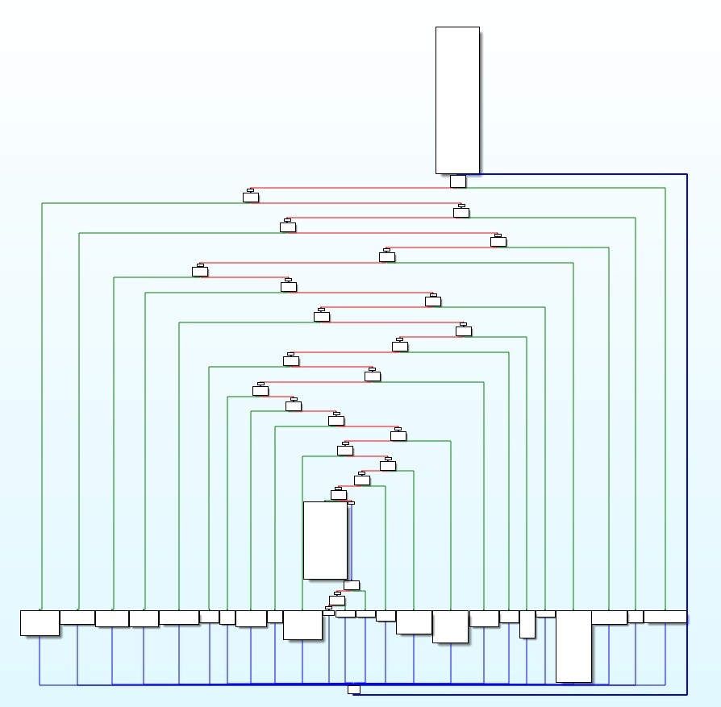
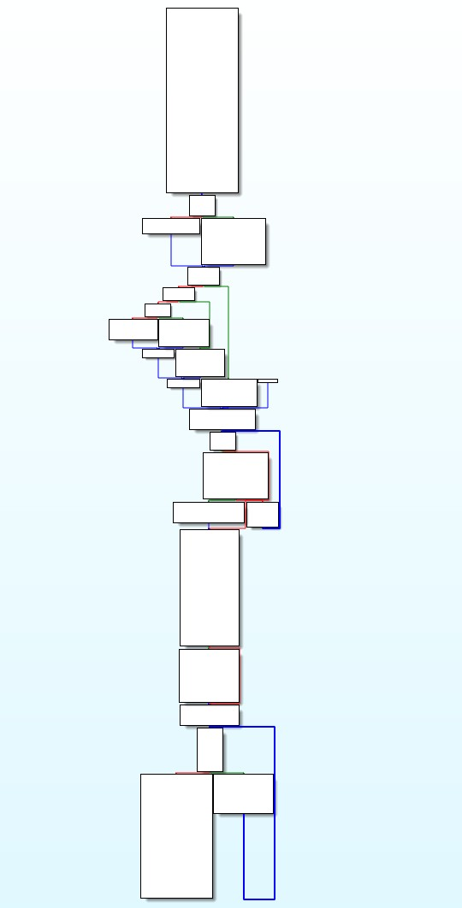

# ollvm-unflattener

A Python tool to deobfuscate control flow flattening applied by OLLVM (Obfuscator-LLVM). This tool leverages the Miasm framework to analyze and recover the original control flow of functions obfuscated with OLLVM's control flow flattening technique.

## Project Description

OLLVM (Obfuscator-LLVM) is a popular code obfuscation tool that implements various obfuscation techniques, including control flow flattening on the function level. Control flow flattening transforms the original flow of a function into a flat structure using a state variable and a dispatch mechanism, making it difficult to understand the program's logic during the reverse engineering process.

This tool:
- Reconstructs the original control flow of an obfuscated function by identifying and connecting basic blocks
- Generates a deobfuscated binary with the original control flow restored
- Supports multi-layered function deobfuscation by following calls made by the target function using breadth-first search (BFS)
- Supports deobfuscation for Windows & Linux binaries (x86 and x64 architectures)
- **NEW**: Supports Android ARM64 (aarch64) binaries

This project is inspired by [MODeflattener](https://github.com/mrT4ntr4/MODeflattener) and the awesome work from [Quarkslab](https://blog.quarkslab.com/deobfuscation-recovering-an-ollvm-protected-program.html)! Unlike **MODeflattener** that solves CFF deobfuscation with a static approach, this project utilitizes Miasm's symbolic execution engine to execute and recover the original control flow. 

## Installation

### Prerequisites
- Python 3.10+
- Git

### Setup

1. Clone the repository:
```bash
git clone https://github.com/cdong1012/ollvm-unflattener.git
cd ollvm-unflattener
```

2. Install required dependencies:
```bash
pip install -r requirements.txt
```

The `requirements.txt` file includes:
```
miasm
graphviz
keystone-engine
```

## Usage

### Basic Usage

```bash
python unflattener -i <input file> -o <output file> -t <target function addresss> -a
```

### Arguments

- `-i, --input`: Path to the obfuscated binary (required)
- `-o, --output`: Path where the deobfuscated binary will be saved (required)
- `-t, --target`: Address of the function to deobfuscate (required)
- `-a, --all`: Follow all calls and deobfuscate all functions we can reach
- `-h, --help`: show help message

### Example

```bash
# Deobfuscate a single function
python unflattener -i ./samples/linux/CFF.bin -o ./samples/linux/deob_CFF.bin -t 0x80491A0
python unflattener -i ./samples/win/CFF_win.exe -o ./samples/win/deob_CFF_win.bin -t 0x401600

# Deobfuscate Android ARM64 binary
python unflattener -i ./samples/android/libcff_arm64.so -o ./samples/android/deob_libcff_arm64.so -t 0x12345678

# Deobfuscate a function and follows all of its calls
python unflattener -i ./samples/linux/CFF_full.bin -o ./samples/linux/deob_CFF_full.bin -t 0x8049E00 -a
python unflattener -i ./samples/win/CFF_win_full.exe -o ./samples/win/deob_CFF_win_full.bin -t 0x401F10 -a
```

## Results

### Visual Comparison

Below you can see the control flow graph (CFG) before and after deobfuscation:


*Figure 1: Obfuscated CFG*



*Figure 2: Deobfuscated CFG*

These images are from deobfuscating function ```target_function``` from the sample [CFF_full.bin](./samples/linux/CFF_full.bin).

## Acknowledgements

- [Miasm](https://github.com/cea-sec/miasm)
- [Obfuscator-LLVM](https://github.com/obfuscator-llvm/obfuscator)
- [MODeflattener](https://github.com/mrT4ntr4/MODeflattener)
- [Quarkslab](https://blog.quarkslab.com/deobfuscation-recovering-an-ollvm-protected-program.html)
